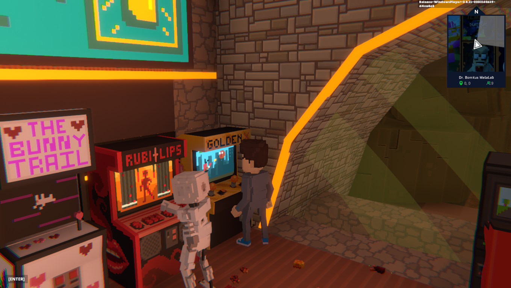
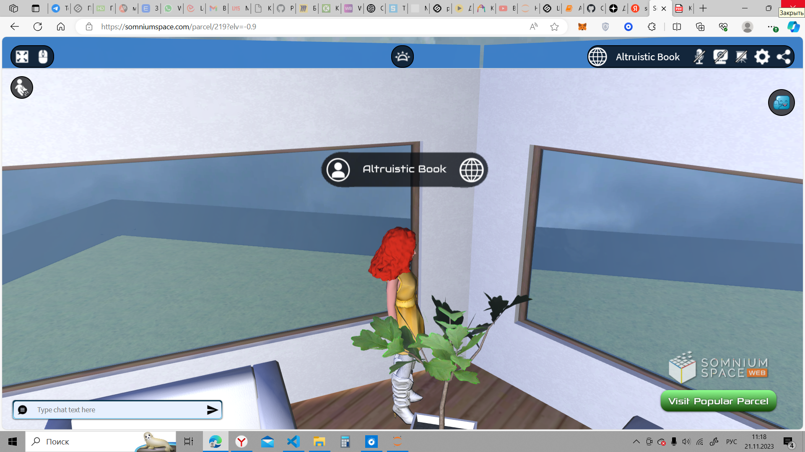
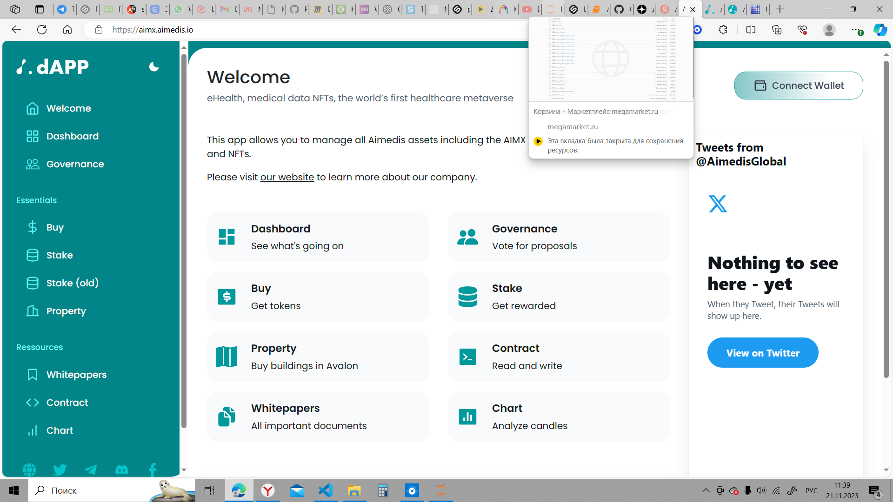

1) Самостоятельно скачать и попробовать зайти в метавселенную TheSANDBOX (The Sandbox Game). Сделать свой скриншот в ней и выложить google docs.

2) Выбрать метавселенную для посещения. Сделать свой скриншот в ней и выложить google docs.

3) С учетом полученного опыта указать, какие метавселенные по вашему мнению обладают наибольшими перспективами лично для вс с учетом ваших навыков и интересов и обосновать почему. В письменном виде разместить в google docs.

Для меня наибольшими перспективами обладает применение  метавселенных в практической медицине.
Основные напрвления на данный момент:

 - СОЗДАНИЯ ЭФФЕКТА РЕАЛИСТИЧНОГО 
ПОГРУЖЕНИЯ ПРИ ВЗАИМОДЕЙСТВИИ 
С ПАЦИЕНТОМ. Основным перспективным направлением 
для использования технологий метавселенных 
из-за их возможности передавать впечатления, 
близкие к реальным (эффект реалистичного 
погружения), являются телемедицинские коycультации расширенного формата, когда при 
помощи цифровых двойников врач и пациент 
встречаются в виртуальном кабинете с целью 
удаленной диагностики, лечения или информирования о заболевании или предстоящих медицинских процедурах на наглядных 3D-моделях.
- ПРИМЕНЕНИЕ МЕТАВСЕЛЕННЫХ 
ДЛЯ ДИАГНОСТИКИ ЗАБОЛЕВАНИЙ 
И ЛЕЧЕНИЯ ПАЦИЕНТОВ. Для осуществления удаленной диагностики 
при телемедицинской консультации в метавселенной возможно использование технологий 
ИИ и смешанной реальности (mixed reality, MR), 
портативных сканирующих устройств для создания 3D-моделей тела или отдельных органов, а 
также сенсорных иммерсивных перчаток, передающих реалистичные тактильные ощущения 
при прикосновении к цифровому двойнику пациента. 
В работе Skalidis et al. (2022) представлен первый в мире реальный случай проведения телемедицинской консультации в виртуальном мире, 
приближающемся по своим характеристикам к 
полноценной метавселенной, для пациента с вазоспастической стенокардией. После экстренной 
госпитализации с жалобами на рецидивирующие боли в груди мужчине 30 лет на дом выданы 
компактное носимое устройство, подключенное 
к смартфону и регистрирующее электрокардиограмму (ЭКГ) в 12 отведениях, автоматический 
тонометр, пульсоксиметр и VR-шлем, а также 
предоставлен доступ к платформе медицинской 
метавселенной «Aimedis Avalon» для срочной 
консультации с врачом при рецидиве боли.

- ПРИМЕНЕНИЕ МЕТАВСЕЛЕННЫХ 
В РЕАБИЛИТАЦИИ ПАЦИЕНТОВ. Вопросам применимости технологий метавселенных в лечении и реабилитации пациентов с болезнью Альцгеймера посвящена работа 
Zhou et al. (2022). 

- МЕТАВСЕЛЕННЫЕ В МЕДИЦИНСКОМ 
ОБРАЗОВАНИ

Использованная мною статья: 
https://www.vit-j.ru/upload/iblock/0e6/2hi44u6zhl6nqrqga37d22z2qmwcpyz5/01.pdf
