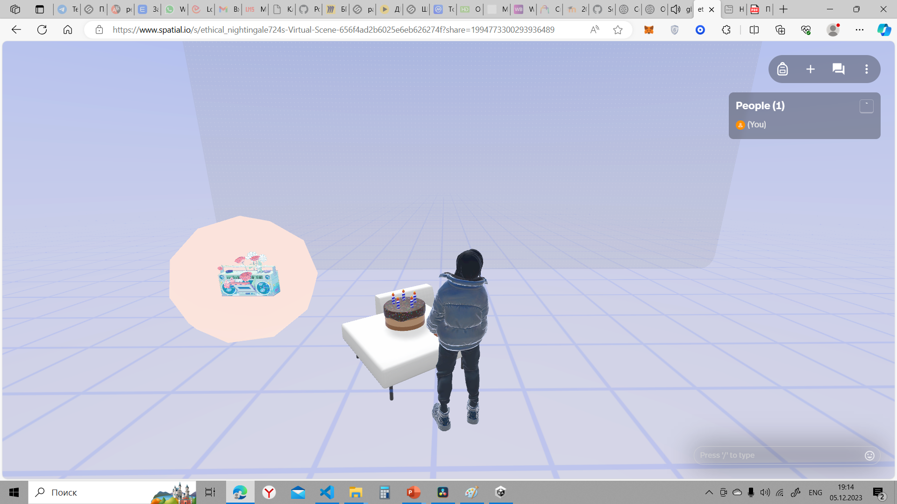

1) На главной страницe библиотеки Three.js (https://threejs.org/) есть иконки проектов, которые используют библиотеку. Изучите проекты из каталога, выберите 1 самый интересный и загрузите в документ информацию о проекте с ссылкой, названием, скриншотом и небольшим описанием.
https://threejs.org/examples/#webgl_effects_anaglyph
Название проекта effects_anaglyph

описание и код проекта можно посмотреть здесь
https://github.com/mrdoob/three.js/blob/master/examples/webgl_effects_anaglyph.html

2) Найти модель (на sketchfab.com или другом сайте с моделями) для создания среды в Spatial.io и скачать её. Проверить её в предпросмотре на компьютере. В документе ДЗ прикрепить скриншот.

3) Создать в режиме NO-CODE на основе этой модели собственное пространство в метавселенной spatial.io. Ссылку на пространство добавить в документ с ДЗ.

https://www.spatial.io/s/ethical_nightingale724s-Virtual-Scene-656f4ad2b6025e6eb626274f?share=1994773300293936489

